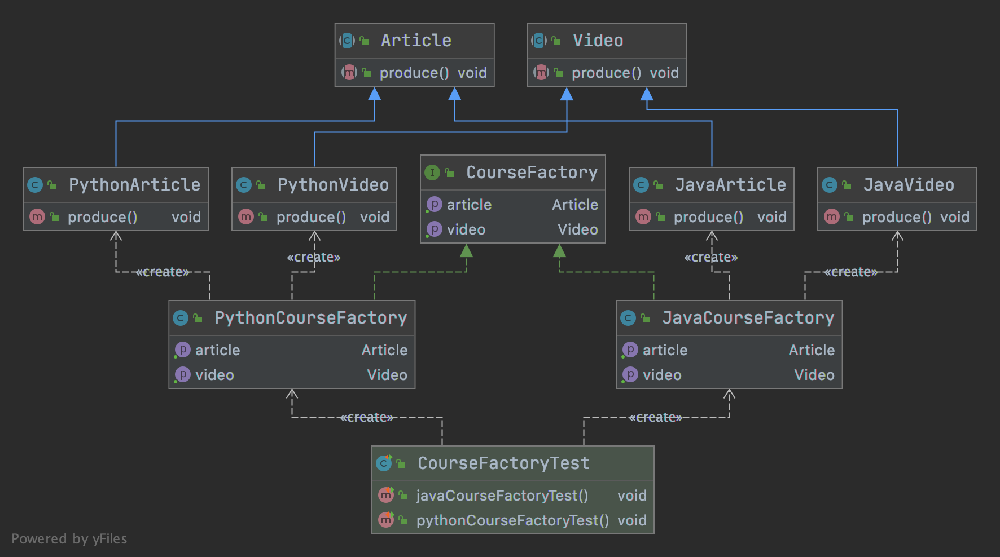

# 抽象工厂

- 定义

      抽象工厂模式提供一个创建一系列相关或相互依赖对象的接口
      
      无需指定他们具体的类
      
- 类型

        创建型

- 适用场景

      客户端（应用层）不依赖于产品类的实例如何被创建、实现等细节
      
      强调一系列相关产品对象（属于同一产品族）一起适用创建对象需要大量重复的代码
      
      提供一个产品类的库，所有的产品以同样的接口出现，从而使客户端不依赖于具体的实现
      
      不需要经常修改的产品
         
# 优缺点

- 优点

      具体产品在应用层代码隔离，无需关心创建细节
      
      将一个系列的产品族统一到一起创建

- 缺点

      规定了所有可能被创建的产品集合，产品族中扩展新的产品困难，需要修改抽象工厂的接口
      
      增加了系统的抽象性和理解难度

# 代码

- [代码](../../../src/main/java/xyz/zzyitj/demo/designpattern/creational/abstractfactory)
- [测试](../../../src/test/java/xyz/zzyitj/demo/designpattern/creational/abstractfactory/CourseFactoryTest.java)

```java
/**
* {@link java.sql.Connection#createStatement()}}
* 和
* {@link java.sql.Connection#prepareStatement(java.lang.String)}}
* 都属于同一个产品族，类似{@link xyz.zzyitj.demo.designpattern.creational.abstractfactory.CourseFactory}
* 根据调用方法获取到不同对象
* <p>
* 还有一个{@link java.sql.Statement}
*/
public class Test{
}
```

# 结构
